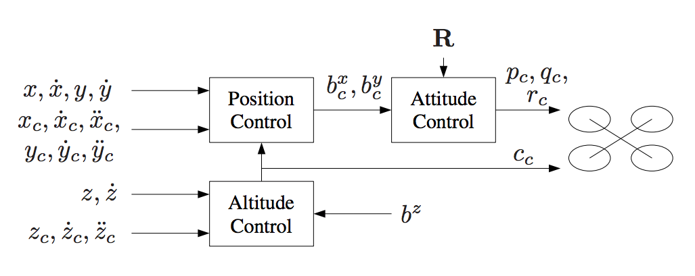
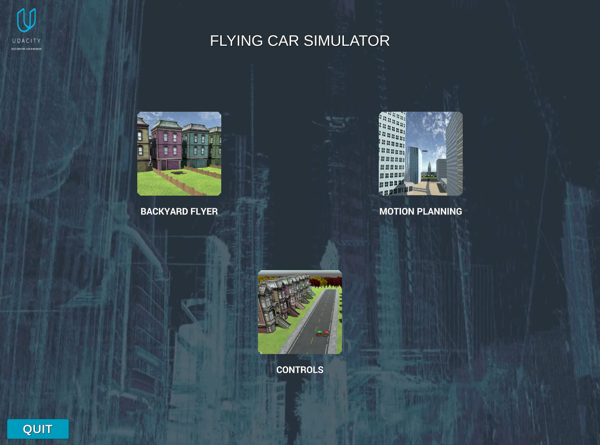
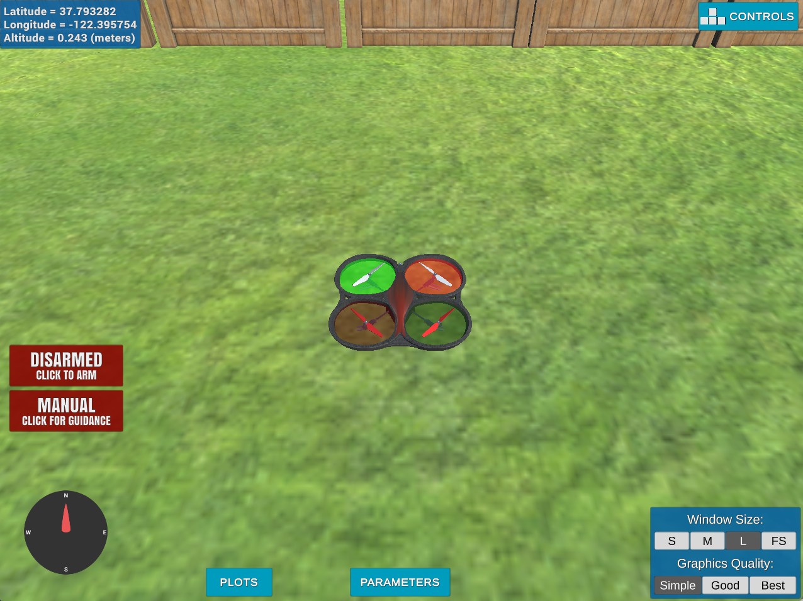
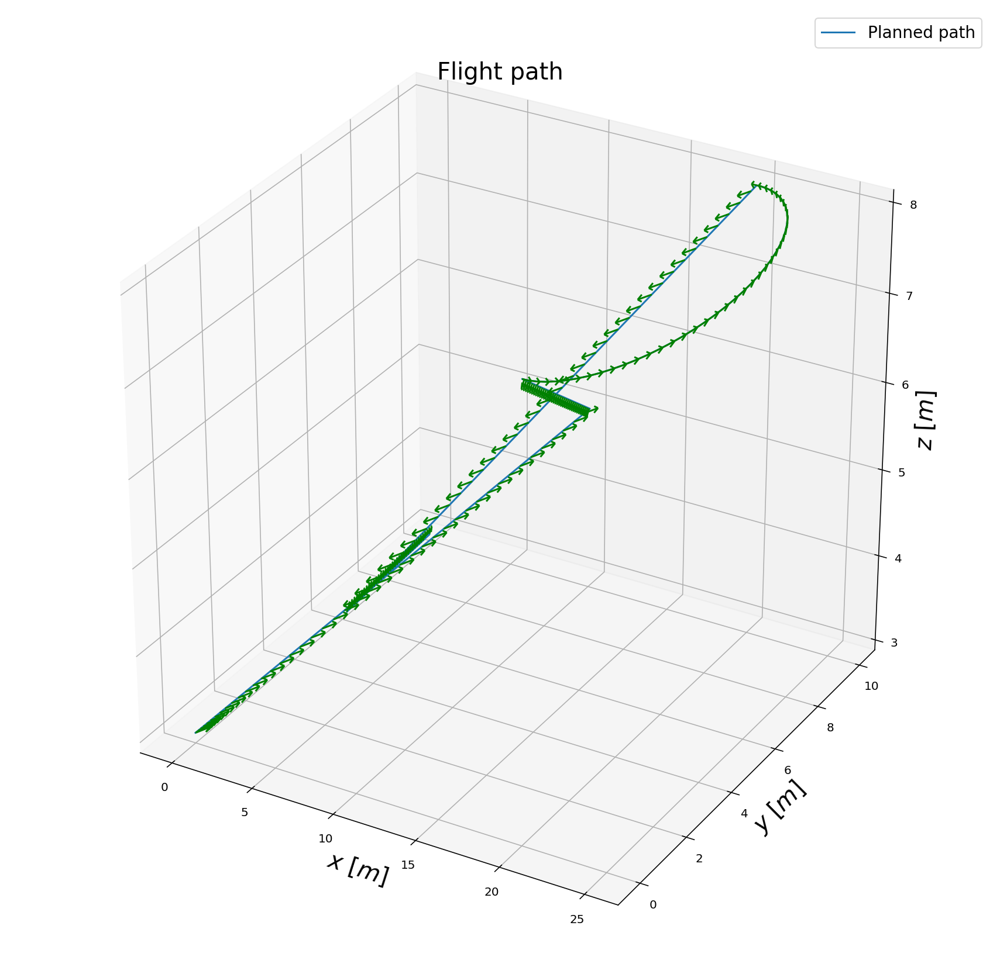
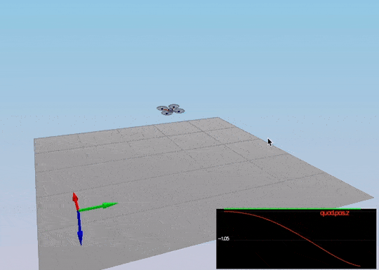

# FCND-Term1-P3-3D-Quadrotor-Controller
Udacity Flying Car Nanodegree - Term 1 - Project 3 - 3D Quadrotor Controller

In this project you get to implement and tune a [cascade PID controller](https://controlstation.com/cascade-control-cascade-control-configured/) for drone trajectory tracking. The theory behind the controller design using feed-forward strategy is explained in details on our instructor, [Angela P. Schoellig](http://www.dynsyslab.org/prof-angela-schoellig/), on her paper [Feed-Forward Parameter Identification for Precise Periodic
Quadrocopter Motions](http://www.dynsyslab.org/wp-content/papercite-data/pdf/schoellig-acc12.pdf). The following diagram could be found on that paper describing the cascaded control loops of the trajectory-following controller:



# Project description

There two parts for this project where the controller needs to be implemented with python on the first one, and with c++ in the second one.

## Python implementation

Based on the [first project](https://github.com/darienmt/FCND-Term1-P1-Backyard-Flyer) on the FCND. We need to control a simulated drone using python to fly in a square trajectory in a backyard. The controller needs to be implemented on the [controller.py class](./python/controller.py). Udacity provides a [seed project](https://github.com/udacity/FCND-Controls) all the code you need to be able to focus only on the controller, but changes on that code is welcome as well.  Udacity's FCND Simulator could be downloaded [here]((https://github.com/udacity/FCND-Simulator-Releases/releases). The python code use [Udacidrone](https://udacity.github.io/udacidrone/) API to communicate with the simulator. This API use [MAVLink](http://qgroundcontrol.org/mavlink/start) protocol.

### Prerequisites

To run this project you need to have the following software installed:

- [Miniconda](https://conda.io/miniconda.html) with Python 3.6. I had some problems while installing this on my Mac after having an older version install and some other packages install with Homebrew. I have to manually delete all the `~/*conda*` directory from my home and then install it with `bash Miniconda3-latest-MacOSX-x86_64.sh -b`.
- [Udacity FCND Simulator](https://github.com/udacity/FCND-Simulator-Releases/releases) the latest the better.

### Run the code

Change directory to where you clone this repo, and move to the [/python](./python) directory. Let's call that directory **REPO_PYTHON_PATH**. Create the conda environment for this project:
```
conda env create -f environment.yml
```
**Note**: This environment configuration is provided by Udacity at [the FCND Term 1 Starter Kit repo](https://github.com/udacity/FCND-Term1-Starter-Kit).

Activate your environment with the following command:
```
source activate fcnd
```
Start the drone simulator. You will see something similar to the following image:



Click on **CONTROLS** item and you will see the drone on the ground:



At this point, the simulator is waiting for connections ready to fly the drone. Time to run the controller.

```
python controls_flyer.py
```

The drone will follow the trajectory specified by the file [test_trajectory.txt](./python/test_trajectory.txt). The video of the drone could be found [here](python-simulator.mov):


At the end of the execution, the code evaluates the execution based on the project acceptance criteria. You should see something similar to this:

```
python controls_flyer.py
Logs/TLog.txt
For visual autograder start visdom server: python -m visdom.server
Logs/NavLog.txt
starting connection
arming transition
takeoff transition
landing transition
disarm transition
manual transition
Closing connection ...
Maximum Horizontal Error:  1.6877431474840618
Maximum Vertical Error:  0.6513343825915365
Mission Time:  4.223532
Mission Success:  True
```
The telemetry file for this particular execution is [this file](./python/telemetry/TLog02.txt). To tune the controller is very hard on this trajectory. At the beginning, you don't know what to expect. The trajectory looks something like this:



In order to check the implementation and do some tuning of the parameters before testing them on the real trajectory, I generated the following trajectories:

- [go_north_east](./python/trajectories/go_north_east.txt)
- [go_north](./python/trajectories/go_north.txt)
- [stay_there](./python/trajectories/stay_there.txt)

To load one of this trajectories instead of [test_trajectory.txt](./python/test_trajectory.txt), uncomment line 210 on [controls_flyer.py](./python/controls_flyer.py#L210) and set the desired trajectory file there. The generation of the trajectories was done by [Test Trajectory](./visualizations/Test Trajectory.ipynb) Jupyter Notebook.

## C++ implementation

This is the more complicated part of the project. If the parameter tuning on the python part was hard, this part is ten time harder. The C++ part is just a detail on this tough task. In this case, the simulator is enforce more real limits to the implementation and things can go really wrong when some of those limits are not implemented properly. More interesting than that is when things are not completely wrong, just a bit wrong. Udacity also provide a [seed project](https://github.com/udacity/FCND-Controls-CPP) with the simulator implementation and place holders for the controller code. The seed project README.md provide guides to run the project and information of the task we need to execute for implementing the controller. There are five scenarios we need to cover. The simulator run in loop on the current scenario and show on the standard output an indication the scenario pass or not.

All the C++ code is in the [/cpp](./cpp) directory. The more interesting files are:

- [/cpp/config/QuadControlParams.txt](./cpp/config/QuadControlParams.txt): This file contains the configuration for the controller. While the simulator is running, you can modify this file and the simulator will "refresh" those parameter on the next loop execution.
- [/cpp/src/QuadControl.cpp](./cpp/src/QuadControl.cpp): This is where all the fun is, but I should not say this because this file contains the implementation of the controller only. Most of the time needed to pass the scenarios is spend on the parameter tuning.

### Prerequisites

Nothing extra needs to be install but the IDE needed to compile the code. In my case XCode because I am using a Macbook. Please, follow the instructions on the [seed project README.md](https://github.com/udacity/FCND-Controls-CPP).

### Run the code

Following the instruction on the seed project, load the project on the IDE. Remember the code is on [/cpp](./cpp).

#### Scenario 1 : Intro

In this scenario, we adjust the mass of the drone in [/cpp/config/QuadControlParams.txt](./cpp/config/QuadControlParams.txt) until it hover for a bit:



The video for is [cpp-scenario-1.mov](./videos/cpp-scenario-1.mov)


# [Project Rubric](https://review.udacity.com/#!/rubrics/1643/view)

## Writeup
### Provide a Writeup / README that includes all the rubric points and how you addressed each one. You can submit your writeup as markdown or pdf.

## Implemented Controller

### Implemented body rate control in python and C++.

### Implement roll pitch control in python and C++.

### Implement altitude control in python.

### Implement altitude controller in C++.

### Implement lateral position control in python and C++.

### Implement yaw control in python and C++.

### Implement calculating the motor commands given commanded thrust and moments in C++.

## Flight Evaluation

### Your python controller is successfully able to fly the provided test trajectory, meeting the minimum flight performance metrics.

### Your C++ controller is successfully able to fly the provided test trajectory and visually passes inspection of the scenarios leading up to the test trajectory.
